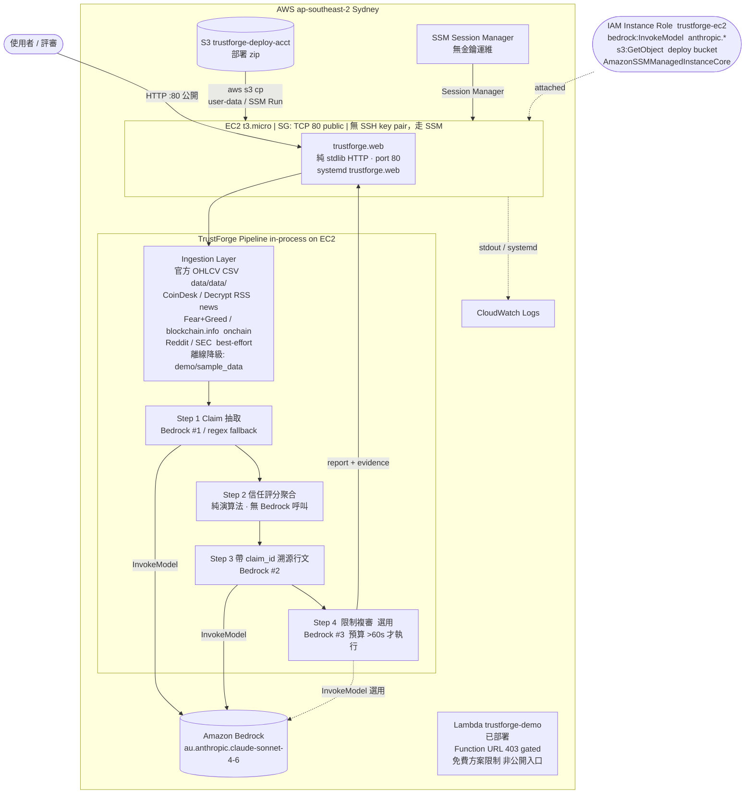

# TrustForge — AWS 架構（決賽簡報用）

> **版本**：真實已部署架構（2026-06）
> **競賽硬規則**：僅限 AWS 基礎模型 → 全程走 Amazon Bedrock，不呼叫任何其他供應商
> **公開主機**：EC2 t3.micro @ ap-southeast-2（雪梨）

---

## 架構圖



---

## AWS 服務對應表

| 服務 | 用途 | 為何選它 | 真實狀態 |
|------|------|---------|---------|
| **EC2 t3.micro** | 公開 HTTP 伺服器，跑 `trustforge.web`（port 80） | 最直接的公開 IP + systemd 常駐，無冷啟動延遲 | **已部署**，公開 IP，ap-southeast-2 |
| **Amazon Bedrock** | 唯一 LLM 入口（`bedrock.py`），Step1/3/4 呼叫 `au.anthropic.claude-sonnet-4-6` | 競賽規則：僅限 AWS 基礎模型；集中於 `bedrock.py` 方便合規審查 | **已部署**，instance role 直接呼叫 |
| **S3** | 部署 zip 暫存（`trustforge-deploy-{acct}`）；EC2 user-data / SSM 從這裡拉取更新 | 比傳送大檔到 EC2 更可靠，冪等 | **已部署** |
| **IAM Instance Role** | `trustforge-ec2`：最小權限（bedrock:InvokeModel + s3:GetObject + SSMCore），無 access key | 符合最小權限原則，不需在 EC2 儲存長效 credential | **已部署** |
| **SSM Session Manager** | 無金鑰遠端運維（含 Session、Run Command） | 不需開 SSH port，符合 zero-trust；EC2 無 key pair | **已部署**（AmazonSSMManagedInstanceCore） |
| **CloudWatch Logs** | EC2 systemd/stdout 日誌落地 | 預設收集，可觀測 | **已部署**（預設） |
| **Lambda** | `trustforge-demo` 函數已部署，可執行 | 部署流程涵蓋（`deploy/deploy_lambda.sh`） | **已部署但 Function URL 403 gated**（免費方案限制）；**不作公開入口，公開入口為 EC2** |

### 未採用服務（舊願景規劃，實際未部署）

| 服務 | 說明 |
|------|------|
| AWS App Runner | 未採用。改用 EC2 直接部署，避免容器化額外複雜度 |
| AWS Step Functions | 未採用。Pipeline 4 步驟在 EC2 單一 Python 行程內直接順序執行，不需跨服務編排 |
| Amazon DynamoDB | 未採用。快取需求不存在（每次 per-request 即時抓取，逾時直接降級） |
| API Gateway | 未採用。EC2 Security Group 直接開 TCP 80，不需額外閘道層 |
| AWS Secrets Manager | 未採用。外部 API key 目前不持久化（連接器以離線模式或公開端點為主） |
| CloudFront / Amplify | 未採用。無靜態前端資產 CDN 需求 |

---

## 15 分鐘執行預算對策

競賽規定每次分析限 15 分鐘。TrustForge 的實際表現遠優於此限制：

| 指標 | 數值 |
|------|------|
| 實測 per-run 耗時 | ~25–68 秒 |
| 競賽上限 | 900 秒（15 分鐘） |
| 餘裕倍數 | ~13–36 倍 |

**預算控制機制**：

- `ExecutionLog.remaining()` 全程追蹤剩餘秒數；Step 4（限制複審）設 `>60s` 門檻，接近預算時自動跳過，不阻塞報告輸出。
- 各 Ingestion 來源失敗（逾時/連線錯誤）**個別降級跳過**，不卡住整條管線；失敗來源名稱自動填入 `report.limits`，供評審可見。
- 公開面預設**離線示範模式**（`demo/sample_data`），無需等待外部 API；真實 Bedrock 分析需 `TRUSTFORGE_LIVE_TOKEN` token-gate 保護。

---

## 安全設計

| 面向 | 實作 |
|------|------|
| **最小 IAM** | Instance Role 僅 `bedrock:InvokeModel`（限 `anthropic.*` / `inference-profile/*anthropic*`）+ `s3:GetObject`（限 deploy bucket）+ SSMCore；無其他 AWS 權限 |
| **無金鑰運維** | EC2 無 SSH key pair，維運走 SSM Session Manager，不開 port 22 |
| **離線預設** | 公開 EC2 預設離線示範，真實 Bedrock 呼叫需 `TRUSTFORGE_LIVE_TOKEN` HTTP header |
| **token gate** | Live 模式 token-gated（環境變數 `TRUSTFORGE_LIVE_TOKEN`），防止 Bedrock 被濫用 |
| **反作弊（模型層）** | `bedrock.py` 強制：`fact` 型 claim 只能來自客觀來源（price/onchain/regulatory），社群/新聞主張一律降為 `inference`，不得宣稱是事實 |
| **版控安全** | pre-push hook：pytest 全綠才放行；GitHub + Gitea 雙遠端；不入版控任何 AWS credential |

---

## 與 HOYA BIT 理念對齊

HOYA BIT「AI Native Exchange OS」的核心定位是：**不代替投資決策，提供明確確認機制**。

TrustForge 與此理念同向：

- **不代客決策**：報告輸出「可查證分析 + 信心分數 + 反方證據 + 已知限制」，明確標示不確定性，而非給出買賣建議。
- **溯源透明**：每條主張（Claim）帶 `claim_id` 溯源到原始文件，評審可一路追回原始資料來源。
- **客觀 / 主觀分層**：`fact` 型主張只能來自客觀數據源（OHLCV / onchain / regulatory），社群輿論嚴格標記為 `inference` 或 `opinion`，防止主觀資訊被誤當事實。
- **市場資訊信任層**：TrustForge 可作為 HOYA BIT AI 入口的「市場資訊信任層」延伸——在資訊進入決策前，先做可查證的信任評分與溯源。

---

## 部署流程（EC2 更新）

```
本機開發 → pytest 通過 → git push
            ↓
    pre-push hook（可選 AWS CLI CD）
            ↓
    zip 打包 → s3 cp s3://trustforge-deploy-{acct}/trustforge_app.zip
            ↓
    SSM Run Command: aws s3 cp + unzip + systemctl restart trustforge
```

腳本：`deploy/deploy_ec2.sh`（冪等，IAM role / SG / user-data 全部自動建立）
