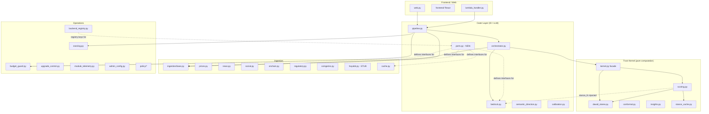

# 架構盤點總報告 — 2026-07-21

> Issue: #380 | 截止 commit: `60efb17` (main)
> 盤點者：HurricaneSoft 架構工程
> 目的：確認各模組「已登記」vs「runtime 已接線」的真實狀態

---

## 總覽

TrustForge 由 4 大層級組成：**Trust Kernel**（核心計算）→ **Outer Layer**（IO/LLM/Agent）→ **Operations**（控制面/治理）→ **Frontend/Web**（Live Demo）。截至本次盤點，共 31+ 模組登記於升級控制面，核心治理邊界已建立，但 provider ports 與 runtime resolver 尚未全面接通。

---

## 模組清單與狀態

### Layer 1: Trust Kernel（信任核心 — 純計算）

| 模組 | 路徑 | 狀態 | 說明 |
|------|------|------|------|
| Kernel Facade | `trust/kernel.py` | ✅ implemented | Stable re-export，零 IO 依賴邊界 |
| Scoring Engine | `trust/scoring.py` | ✅ implemented | 四維信任評分、claim 抽取、aggregate |
| Dawid-Skene EM | `trust/dawid_skene.py` | ✅ implemented | 動態來源信譽（純計算） |
| Conformal Prediction | `trust/conformal.py` | ✅ implemented | 信心帶統計校準 |
| Insights Generator | `trust/insights.py` | ✅ implemented | Tier-2 洞察提取 |
| Stance Cache | `trust/stance_cache.py` | ✅ implemented | stance 結果快取與 fn builder |

### Layer 2: Outer Layer（IO / LLM / Agent 編排）

| 模組 | 路徑 | 狀態 | 說明 |
|------|------|------|------|
| Bedrock Client | `bedrock.py` | ✅ implemented | 唯一 LLM 入口，含 stance 專用 client |
| Pipeline | `pipeline.py` | ✅ implemented | 共用管線入口（offline/live 模式） |
| Orchestrator | `agent/orchestrator.py` | ✅ implemented | 4 步推理（claim→score→prose→review） |
| **Provider Ports** | `ports.py` | ✅ implemented | Protocol 定義（本 PR 新增） |
| Semantic Direction | `semantic_direction.py` | ✅ implemented | 方向性語意分類 |
| Calibration | `calibration.py` | ✅ implemented | 信心校準模型 |
| Calibration Model | `calibration_model.py` | ✅ implemented | 統計校準器 |

### Layer 2a: Ingestion（多源連接器）

| 模組 | 路徑 | 狀態 | 說明 |
|------|------|------|------|
| Base / Document | `ingestion/base.py` | ✅ implemented | 統一介面 + Source ABC |
| Prices (OHLCV) | `ingestion/prices.py` | ✅ implemented | 官方 + 合成 OHLCV 讀取 |
| News | `ingestion/news.py` | ✅ implemented | 新聞連接器（離線樣本） |
| Social | `ingestion/social.py` | ✅ implemented | 社群連接器（離線樣本） |
| On-chain | `ingestion/onchain.py` | ✅ implemented | 鏈上數據連接器 |
| Regulatory | `ingestion/regulatory.py` | ✅ implemented | 監管公告連接器 |
| HOYA BIT | `ingestion/hoyabit.py` | 📋 stub | ticker stub，缺正式 HTTPS contract |
| CoinGecko | `ingestion/coingecko.py` | ✅ implemented | 現價 + 情緒 + 開發活動 |
| Whale Trades | `ingestion/whale_trades.py` | ✅ implemented | 鯨魚/名人交易信號 |
| Cache (SQLite) | `ingestion/cache.py` | ✅ implemented | 統一快取層 |
| Safe Fetch | `ingestion/safe_fetch.py` | ✅ implemented | HTTP 安全抓取 + timeout |

### Layer 3: Operations（控制面 / 治理 / 平台）

| 模組 | 路徑 | 狀態 | 說明 |
|------|------|------|------|
| Budget Guard | `budget_guard.py` | ✅ implemented | Bedrock 成本護欄 + daily cap |
| Budget Counter | `budget_counter.py` | ✅ implemented | DynamoDB token 計數器 |
| Cost Model | `cost_model.py` | ✅ implemented | per-model 定價 |
| Ledger | `ledger.py` | ✅ implemented | 成本帳本（SQLite） |
| Ledger Archive | `ledger_archive.py` | ✅ implemented | 帳本歸檔 |
| Backend Registry | `backend_registry.py` | 🔧 partial | 宣告 7 key，但 pipeline 未普遍透過 get_provider() resolve |
| Upgrade Control | `upgrade_control.py` | ✅ implemented | 31 模組 revision/channel/state |
| Upgrade Queue | `upgrade_queue.py` | ✅ implemented | stage/approve/rollback 佇列 |
| Upgrade Review | `upgrade_review.py` | ✅ implemented | 審核流程 |
| Module Status | `module_status.py` | 🔧 partial | 狀態回報預設卡（非 runtime verified） |
| Module Telemetry | `module_telemetry.py` | ✅ implemented | 可觀測性遙測 |
| Admin Config | `admin_config.py` | ✅ implemented | Admin API 設定管理 |
| Execution Log | `execlog.py` | ✅ implemented | 15 分鐘預算追蹤 + JSONL |
| SSM Params | `ssm_params.py` | ✅ implemented | AWS SSM 參數讀取 |
| Rate Limit Store | `rate_limit_store.py` | ✅ implemented | DynamoDB rate limiter |
| Runtime Control | `runtime_control.py` | ✅ implemented | 執行開關 |
| Security Gate | `security_gate.py` | ✅ implemented | 安全閘門 |
| Skills Registry | `skills.py` | ✅ implemented | Outer skill manifest 凍結 |
| Skill Changes | `skill_changes.py` | ✅ implemented | 技能變更管理 |
| Data Contracts | `data_contracts.py` | ✅ implemented | 版本化 JSON Schema |
| Data Quality | `data_quality.py` | ✅ implemented | 資料品質檢查 |
| Connector Reliability | `connector_reliability.py` | ✅ implemented | 連接器可靠性統計 |

### Layer 3a: Policy（策略執行器）

| 模組 | 路徑 | 狀態 | 說明 |
|------|------|------|------|
| Policy Schema | `policy/schema.py` | ✅ implemented | 策略資料結構 |
| Policy Compiler | `policy/compiler.py` | ✅ implemented | YAML→runtime policy 編譯 |
| Policy Executor | `policy/executor.py` | ✅ implemented | 受限執行層 |
| Policy Loader | `policy/loader.py` | ✅ implemented | 從檔案/store 載入 |
| Policy Guards | `policy/guards.py` | ✅ implemented | cost/secret/timeout/PIT/evidence 不可跳過 |

### Layer 4: Frontend / Web

| 模組 | 路徑 | 狀態 | 說明 |
|------|------|------|------|
| Web Server (SPA) | `web.py` | ✅ implemented | 純 stdlib HTTP + 完整 SPA |
| Frontend (React) | `frontend/` | ✅ implemented | Vite + React + TypeScript + Tailwind |
| Lambda Handler | `lambda_handler.py` | ✅ implemented | AWS Lambda 進入點 |

### Infra / 部署

| 項目 | 位置 | 狀態 | 說明 |
|------|------|------|------|
| App Runner | `apprunner.yaml` | ✅ implemented | 原始碼模式建置 |
| Dockerfile | `Dockerfile` | ✅ implemented | 容器路線 |
| Scripts | `scripts/` | ✅ implemented | 管控腳本集 |
| CEO Sweep | `scripts/ceo_sweep.py` | ✅ implemented | 30 分鐘巡檢（唯讀） |

---

## 依賴關係圖

---

## 技術債清單

| # | 缺口 | 影響 | 對應 Issue | 優先級 |
|---|------|------|-----------|--------|
| 1 | **Backend registry 宣告 ≠ runtime 接線** | pipeline/orchestrator 仍直接 import Bedrock，未透過 `get_provider()` resolve | #386 | P1 |
| 2 | **Module status 回傳預設卡** | `active/ready` 不能證明 configured→resolved→invoked→verified | #382 | P1 |
| 3 | **Trust Kernel 混合 outer-layer 組裝** | `scoring.py` 含計算邏輯 + IO adapter 組裝（stance_fn builder），待瘦殼化 | #381 Phase B~D | P2 |
| 4 | **HOYA BIT connector 是 stub** | 缺正式 HTTPS contract，預設 disabled | #167 | P1 |
| 5 | **Outer skill 缺 runtime policy executor** | 凍結/記錄有，安全編譯成 runtime policy 的受限執行層剛建立 | #383 | P2 |
| 6 | **References 狀態高於程式證據** | 部分 ✅ 基於宣告而非 runtime 驗證 | #384 | P2 |
| 7 | **台灣監管資料源缺真實 adapter** | regulatory connector 走離線樣本 | #385 | P2 |
| 8 | **Deploy artifact 邊界不清** | `skills/hermes/deploy` 已歸檔，但 deploy 不屬 SKILL_FAMILIES | #383 | P3 |

---

## 已確認完成（對齊 Issue #380）

- [x] 31 個模組登記於 upgrade control plane，具 revision/channel/state 投影
- [x] Outer skill artifact 具 hash、不可變 revision、approval evidence、activate pointer 與 rollback
- [x] 正式 run 會凍結 outer skill manifest
- [x] Core package 標記 release-locked，禁止 recursive upgrade 與 automatic apply
- [x] Source.fetch()、Evidence schema、PIT boundary、execution log 等基礎契約存在
- [x] Trust Kernel facade 已建立（`trust/kernel.py`），零 IO 依賴邊界由 CI 強制
- [x] Policy executor + guards 已實作（cost/secret/timeout/PIT/evidence 不可跳過）
- [x] Provider ports Protocol 定義完成（`ports.py`，本 PR）

---

## 後續子 Issue 對照

| Issue | 標題 | 狀態 |
|-------|------|------|
| #381 | Trust Kernel 實體隔離 | ✅ Phase 1 完成（facade） |
| #382 | 升級模組真實 runtime verification telemetry | 🗓️ planned |
| #383 | Outer Skill runtime policy executor + deploy 邊界清理 | ✅ implemented |
| #384 | References 狀態 truth audit | 🗓️ planned |
| #385 | 台灣監管資料源 adapters | 🗓️ planned |
| #386 | Provider ports/adapters 真正接入 runtime | ✅ 本 PR（Protocol + test） |
