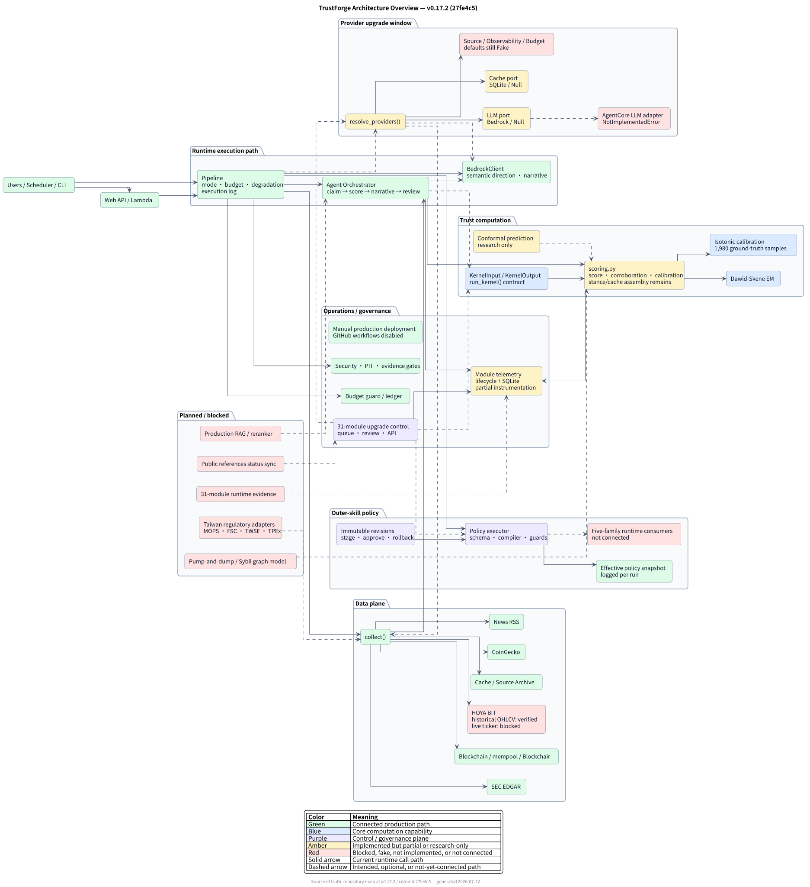
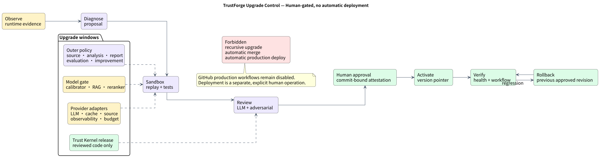
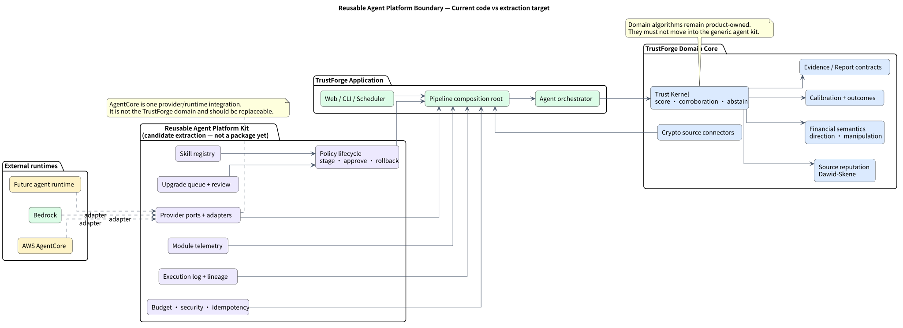

# TrustForge Architecture Overview

> Human-readable rendered page: [`architecture-overview.html`](architecture-overview.html)



This diagram records the verified architecture at `v0.17.2` (`27fe4c5`). It
distinguishes the current production execution path from interfaces, control
planes, research components, and planned integrations.

## Reading the diagram

- Solid arrows are current runtime calls.
- Dashed arrows are intended, optional, or not-yet-connected routes.
- Green nodes are connected production paths.
- Blue nodes are core computation capabilities.
- Purple nodes are upgrade or governance controls.
- Amber nodes are implemented but partial or research-only.
- Red nodes are blocked, fake, unimplemented, or not connected.

## Detailed views

### Trust Kernel runtime boundary


This view separates the current `scoring.py` dependency from the intended pure
kernel. The v2 contract exists, but the production orchestrator does not yet use
`run_kernel()` as its entry point.

### Upgrade control



All upgrade classes share a human gate. Provider, policy, and model candidates
may be tested in a sandbox, but none may automatically merge or deploy. The
Trust Kernel remains a reviewed code release rather than an outer-skill target.

### Reusable agent platform boundary



AgentCore is one replaceable runtime/provider integration. It is not the
TrustForge domain. The repository contains several capabilities that could be
extracted into a reusable agent-platform package, but that extraction has not
yet happened.

| Reusable candidate | Keep inside TrustForge |
|---|---|
| Provider ports and adapters | Trust scoring and corroboration |
| Policy stage/approve/rollback | Source reputation and Dawid–Skene configuration |
| Module telemetry | Financial direction and manipulation semantics |
| Upgrade queue and review | Calibration and market outcome labels |
| Execution log and generic lineage | Crypto/financial source connectors |
| Budget, security and idempotency gates | TrustForge Evidence and Report product contracts |
| Skill registry | Product UI and analysis journeys |

The recommended extraction boundary is:

```text
agent-platform-kit  <- generic agent operations and provider integration
trustforge-core     <- deterministic trust-domain algorithms
trustforge-app      <- pipeline composition, API, UI and deployment assembly
```

The editable sources are:

- [`ARCHITECTURE-OVERVIEW.puml`](ARCHITECTURE-OVERVIEW.puml)
- [`RUNTIME-BOUNDARY.puml`](RUNTIME-BOUNDARY.puml)
- [`UPGRADE-CONTROL-OVERVIEW.puml`](UPGRADE-CONTROL-OVERVIEW.puml)
- [`AGENT-PLATFORM-BOUNDARY.puml`](AGENT-PLATFORM-BOUNDARY.puml)

Regenerate all rendered formats from the repository root with:

```bash
plantuml -charset UTF-8 -tsvg docs/architecture/*.puml
plantuml -charset UTF-8 -tpng docs/architecture/*.puml
```

## Current boundary statement

The upgrade control plane registers 31 modules, but registration is not proof
of runtime invocation. `run_kernel()` and `resolve_providers()` exist, while the
production pipeline still calls `scoring.py`, `BedrockClient`, and `collect()`
directly. Module telemetry and outer-skill policy execution are also only
partially connected. The diagram intentionally preserves those distinctions.
