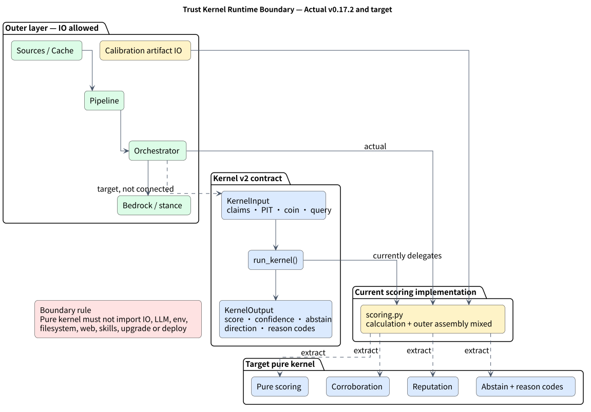

# Trust Kernel Boundary（信任核心邊界）



> Issue: #381 | Spec: `.kiro/specs/trust-kernel-381.md`

## 概述

Trust Kernel 是 TrustForge 信任評分的**純計算核心**，封裝所有信任分數公式、
來源信譽、交叉佐證、時效衰減、操縱扣分的確定性邏輯。

核心設計原則：**零外部依賴邊界**——Kernel 禁止 IO、LLM、cache、網路、
環境變數存取，確保可重現、可測試、可審查。

## 目前狀態（Phase 1 — Facade）

```
src/trustforge/trust/kernel.py     ← 穩定 facade，re-export 純計算介面
src/trustforge/trust/scoring.py    ← 包含計算邏輯 + outer-layer 組裝
src/trustforge/trust/dawid_skene.py ← EM 動態信譽（已是純計算）
```

後續 Phase（PR-B ~ PR-D）會將 `scoring.py` 的純計算函式移入 `kernel/`
sub-package，`scoring.py` 瘦殼化為 adapter。

## Immutable Core（禁止 outer skill/policy 修改）

| 項目 | 位置 | 說明 |
|------|------|------|
| Trust 權重 | `DEFAULT_WEIGHTS` | src=0.5, corr=0.25, rec=0.15, manip=0.40 |
| PIT 時間邊界 | `now_ts` 參數 | 由外層注入，Kernel 不自行取 `time.time()` |
| 來源基礎信譽 | `KIND_REPUTATION` | 各 kind 的先驗信譽，只在此定義 |
| 評分公式 | `TrustScore = w·rep + w·corr + w·rec − w·manip` | 四維加權公式 |
| 操縱模式 | `_MANIP_PATTERNS` | 正則表達式清單 |
| 時效半衰期 | `KIND_HALFLIFE_HOURS` / 預設 12h | 指數衰減函式參數 |
| Evidence 綁定 | claim_id → source → Document | 溯源鏈不可後改 |
| Dawid-Skene EM | `em_source_reliability()` | 確定性收斂、禁用 random |

## Outer Policy（可由 PolicyExecutor / 呼叫端調整）

| 項目 | 位置 | 說明 |
|------|------|------|
| stance_fn 實作 | `stance_cache.py` → `build_stance_fn()` | 快取/線上/mock 切換 |
| stance 配對預算 | `DEFAULT_STANCE_PAIR_BUDGET` | 真呼叫硬上限 |
| stance 時間保留 | `STANCE_TIME_RESERVE_SEC` | 15 分鐘窗口裕量 |
| DS EM 迭代上限 | `n_iter` 參數 | 呼叫端可覆寫 |
| source alias 擴充 | `_SOURCE_ALIASES` | 新來源正規化映射 |

## 禁止 Import 清單（R2）

Trust Kernel 模組（`kernel.py` 及未來 `kernel/` 下所有檔案）禁止 import：

- `trustforge.bedrock` — LLM
- `trustforge.ingestion.*` — IO / 連接器
- `trustforge.web` — UI
- `trustforge.skills` — Skill registry
- `trustforge.budget_guard` — 部署控制
- `trustforge.ledger` — 成本帳本
- `trustforge.agent.*` — Agent 編排
- `boto3` / `botocore` — AWS SDK
- `os.environ` / `os.getenv` — 環境變數
- `urllib` / `http` / `socket` — 網路
- `open()` / `pathlib.Path().read_*` — 檔案 IO

CI 由 `tests/test_trust_kernel.py::test_kernel_boundary_no_prohibited_imports` 強制。

## Aggregate calibration migration（#452）

`trustforge_core.aggregate_scored_claims()` 現在要求 calibration provenance
明確且 fail-closed。舊呼叫若完全省略 calibration 參數，或沿用 canonical
`DEFAULT_CALIBRATION_TABLE`，會走內建 `fixed-heuristic-v1` 相容路徑：

```python
aggregate_scored_claims(scored, query="BTC")
aggregate_scored_claims(
    scored,
    query="BTC",
    calibration_table=DEFAULT_CALIBRATION_TABLE,
)
```

新呼叫應明示版本。固定 heuristic 可省略 table，或傳 canonical default；
自訂 table 必須明示 `ISOTONIC_VERSION`：

```python
aggregate_scored_claims(
    scored,
    query="BTC",
    calibration_model_version=FIXED_HEURISTIC_VERSION,
)

aggregate_scored_claims(
    scored,
    query="BTC",
    calibration_model_version=ISOTONIC_VERSION,
    calibration_table=((0.0, 0.1), (1.0, 0.9)),
)
```

安全邊界如下：

- 未提供版本卻傳入自訂 table：拒絕。
- 顯式傳入 `None` 或未知版本：拒絕。
- `FIXED_HEURISTIC_VERSION` 搭配自訂 table：拒絕。
- isotonic table 必須是 immutable exact tuple，且 x 嚴格遞增、y 單調不減。

`resolved_direction` 顯式 exact string 會原值透傳。省略時暫時保留舊
`run_kernel` 的 deterministic inference，直到 #453 接手 production direction
routing。#452 不修改 orchestrator、report、pipeline 或 production routing。

## 呼叫端 Adapter 模式

```python
# agent/orchestrator.py 或 pipeline.py：
from trustforge.trust.kernel import score, aggregate, DEFAULT_WEIGHTS

# 外層注入 stance_fn（需 IO/Bedrock）
from trustforge.trust.scoring import build_stance_fn
stance_fn = build_stance_fn(bedrock_client, cache_backend)

# 呼叫 score() 時 stance_fn 由外層傳入
scored = score(claims, coin, stance_fn=stance_fn, now=time.time())
brief = aggregate(scored, coin)
```

## 測試矩陣

| 層級 | 測試檔 | 依賴 |
|------|--------|------|
| Kernel 純記憶體 | `test_trust_kernel.py` | 無 AWS / 無 IO |
| Kernel 邊界 | `test_trust_kernel.py` (boundary tests) | AST 掃描 |
| Scoring 整合 | `test_trust_scoring.py` | mock stance_fn |
| Pipeline E2E | `test_analysis_flow.py` | 離線模式 |

## 邊界圖

```
┌─────────────────────────────────────────────────────────────────────┐
│ Outer Layer（允許 IO/LLM/env/network）                               │
│  pipeline.py │ agent/orchestrator.py │ bedrock.py │ ingestion/*      │
│  stance_cache.py │ budget_guard.py │ ledger.py │ skills.py           │
└──────────────────────────────┬──────────────────────────────────────┘
                               │ inject: stance_fn, now_ts, config
                               ▼
┌─────────────────────────────────────────────────────────────────────┐
│ Trust Kernel（純計算，零外部依賴）                                     │
│  kernel.py → scoring.py（計算函式） + dawid_skene.py                  │
│  公式：TrustScore = w·rep + w·corr + w·rec − w·manip               │
└─────────────────────────────────────────────────────────────────────┘
```
